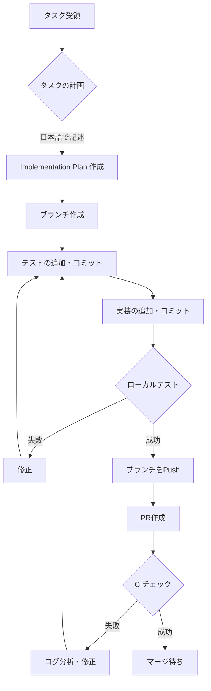

# AGENTS.md

These rules must be followed.

## 📋 開発ライフサイクル（Development Lifecycle）

エージェントがタスクを完了するまでの全体的なフローです。



### 開発フローのチェックリスト

- [ ] タスクを日本語で明確に記述（Implementation Plan）
- [ ] `git switch -c agent/<disposable-branch-name>` でブランチ作成
- [ ] テストを先に書いて `git commit -m "test: ..."`
- [ ] 小さい単位で実装をコミット `git commit -m "feat: ..."`
- [ ] ローカルで `bun test` を実行（成功するまで繰り返し）
- [ ] `git push -u origin agent/<branch-name>` でPush
- [ ] `gh pr create` でPR作成
- [ ] CI失敗時はログ分析して修正→Pushのサイクルを繰り返し

---

## 🌿 Branching

常に使い捨てブランチで作業し、`dev` や `main` に直接コミットしないでください。

### ブランチ名のルール

```bash
git switch -c agent/<disposable-branch-name>
```

### ブランチ名の例

- `agent/improve-agents-md` - 文書改善
- `agent/add-for-component` - Forコンポーネント追加
- `agent/fix-dce-bug` - DCEバグ修正
- `agent/refactor-logging` - ログのリファクタリング

ブランチ名は以下の形式を推奨：
- `agent/<verb>-<target>` - 例: `agent/add-for-component`
- `agent/<verb>-<target>-<detail>` - 例: `agent/fix-compiler-optimize-bug`

---

## 📝 Implementation Plan & Task Description

### タスクの記述

全てのタスクは**日本語**で記述してください。以下の要素を含めます：

1. **目標（Goals）** - 何を達成するか
2. **内部仕様（Internal Shape）** - 実装する機能の内部構造
3. **エッジケース（Edge Cases）** - 考慮すべき境界条件
4. **関連ファイル（Related Files）** - 変更が必要なファイル

### テンプレート

```markdown
## 実装計画

### 目標
<何を達成するかを簡潔に記述>

### 内部仕様
- 実装する機能の内部構造
- 既存コードとの統合方法
- 必要な型定義やインターフェース

### エッジケース
- 考慮すべき境界条件
- 異常系の挙動
- パフォーマンスへの影響

### 関連ファイル
- `packages/runtime/src/xxx.ts` - 変更ファイル
- `packages/runtime/src/xxx.test.ts` - テストファイル
- `docs/xxx.md` - ドキュメント
```

### 実例

```markdown
## 実装計画

### 目標
`For`コンポーネントを実装し、リストレンダリングを可能にする

### 内部仕様
- `For.ts` コンポーネントを作成し、`h.ts` から呼び出す
- `For` は `list` prop と `render` prop を受け取る
- 各要素に対して一意のIDを生成する（`for-App-0-1` の形式）
- 子ノードを親にマージする仕組みを使用

### エッジケース
- 空リストの場合は何もレンダリングしない
- リストの要素がオブジェクトの場合はそのまま渡す
- ネストした `For` コンポーネントにも対応

### 関連ファイル
- `packages/runtime/src/core/components/For.ts` - 新規作成
- `packages/runtime/src/h.ts` - Forの呼び出しを追加
- `packages/runtime/src/core/symbols.ts` - Forシンボルを追加
- `packages/runtime/src/core/components/For.test.ts` - テストファイル
```

---

## 🧪 Tests

### テスト戦略

`bun:test` を使用し、ユニットテストとE2Eテストを適切に使い分けます。

| テスト種類 | 実行場所 | 命令 | コミット | 説明 |
|----------|---------|------|---------|------|
| **Unit Tests** | ローカル/CI | `bun test` | pre-commit | 各機能の単体テスト |
| **E2E Tests** | CIのみ | `bun test:e2e` | CI前後 | 主要なユーザーフローの検証 |
| **All Checks** | CI | `bun run check-all` | - | すべてのチェック |

### テストの優先順位

1. **先にテストを書く** - TDDスタイルでテストから実装
2. **テストを先にコミット** - `git add test.ts && git commit -m "test: ..."`
3. **テストが失敗するのを確認** - 実装前のテストは必ず失敗させる
4. **実装してテストを通す** - 小さい単位で実装とテストのサイクル

### テスト命名規則

詳細は [`docs/TESTING_GUIDELINES.md`](./docs/TESTING_GUIDELINES.md) を参照。

```typescript
describe('英語の機能名: 日本語による概要', () => {
  test('テスト対象の条件: 期待される振る舞い（〜こと）', () => {
    // テストコード
  })
})
```

### レイヤー別のテスト方針

| レイヤー | 検証対象 | 注意点 |
|---------|---------|--------|
| **Runtime/Builder** | `ctx.getAllNodes()`, `ctx.instructions` | IDは `.toContain()` で検証 |
| **JSX/h Function** | `vnode.html`, `vnode.hiddenDerivedRequests` | 正規表現でクラス名の変動を許容 |
| **Codegen** | 生成されたJS文字列 | フォーマットに依存しない正規表現を使用 |
| **Transform** | JSX→h()変換 | `normalize` ヘルパーでフォーマット差異を吸収 |

---

## 💻 Code and Logging

### コーディングの順序

1. **テストを書く**
2. **テストをコミットする**
3. **実装を書く**
4. **ログを追加する**

### ロギングガイドライン

詳細は [`docs/LOGGING_GUIDELINES.md`](./docs/LOGGING_GUIDELINES.md) を参照。

### ロガーの基本

```typescript
import { consola } from 'consola'

// ✅ Good
const logger = consola.withTag('Quix:MyModule')
logger.info('Processing started...')

// ❌ Bad
console.log('Something happened')
```

### モジュール別タグ

| モジュール | タグ名 | 役割 |
|-----------|--------|------|
| Component Builder | `Quix:Builder` | コンポーネント定義、インスタンス化 |
| Runtime / JSX | `Quix:Runtime` | JSX実行、インライン関数抽出 |
| Code Generator | `Quix:Codegen` | JS生成、AST変換、DCE |
| Vite Plugin | `Quix:Vite` | ファイルロード、HTML注入 |

### ログレベル

| レベル | 色 | 用途 | 例 |
|-------|----|------|-----|
| `success` | 🟢 | 成功した処理の概要 | ビルド完了、コード生成完了 |
| `info` | 🔵 | 重要な処理の開始/終了 | コンポーネント解析開始、統計情報 |
| `warn` | 🟡 | 予期しないが継続可能 | 未使用のステート検出、アンカー不在 |
| `debug` | 🟣 | 開発者向けの詳細 | 最適化適用判定、命令数のログ |
| `trace` | ⚪ | デバッグ用の超詳細 | 個々のステート登録、DCE判定理由 |

---

## 🔄 Commit Granularity

小さな単位でコミットし、各コミットはpre-commit（Biome + unit tests）を通過させます。

### コミットメッセージの形式

| プレフィックス | 用途 | 例 |
|---------------|------|-----|
| `test:` | テストの追加 | `test(runtime): add unit tests for For component` |
| `feat:` | 新機能の実装 | `feat(runtime): implement list rendering in For component` |
| `fix:` | バグ修正 | `fix(runtime): resolve nested component issue` |
| `refactor:` | リファクタリング | `refactor(logging): add debug logs to codegen` |
| `docs:` | ドキュメント | `docs: update AGENTS.md with workflow examples` |
| `wip:` | 作業中（実験的） | `wip: implementing nested component handling` |

### コミットフローの例

```bash
# 1. テストを先に追加
git add packages/runtime/src/components/For.test.ts
git commit -m "test(runtime): add unit tests for For component"

# 2. 実装を小さく追加
git add packages/runtime/src/components/For.ts
git commit -m "feat(runtime): add For component structure"

# 3. 実装を追加
git add packages/runtime/src/components/For.ts
git commit -m "feat(runtime): implement list rendering in For component"

# 4. 中間の失敗状態（必要な場合のみ）
git add packages/runtime/src/components/For.ts
git commit --no-verify -m "wip: implementing nested component handling"

# 5. 最終修正
git add packages/runtime/src/components/For.ts
git commit -m "fix(runtime): resolve nested component issue"
```

### WIPコミットの注意点

- `--no-verify` を使用してpre-commitをスキップ
- 明確に `wip:` とラベル付け
- 最終PR前には通常のコミットに置き換えるか、履歴を整理

---

## 🏃 Running Tests

### ローカルでのテスト

```bash
# ユニットテストのみ（pre-commitで実行）
bun test

# 全てのチェック（CIと同等）
bun run check-all
```

### E2Eテスト（CIのみ）

```bash
# E2EテストはCIでのみ実行
bun test:e2e
```

### テストが失敗した場合

1. エラーメッセージを読む
2. 期待値と実際の値を比較
3. 実装かテストのどちらが間違っているか判断
4. 修正して `bun test` を再実行
5. pre-commitを通るまで繰り返す

---

## 🚀 PR and CI Automation

### PR作成の流れ

```bash
# 1. ブランチをPush
git push -u origin agent/<disposable-branch-name>

# 2. PRを作成
gh pr create \
  --base dev \
  --head agent/<disposable-branch-name> \
  --title "<タスク名>" \
  --body "This PR was generated by agent."
```

### PR本文のテンプレート

```markdown
## 目的
<タスクの目的を日本語で記述>

## 変更内容
- <変更点1>
- <変更点2>

## 関連Issue
Closes #<issue番号>

## テスト
- [x] ユニットテストが通過
- [ ] E2Eテストが通過（CIで確認）
```

### CIの監視と失敗時の対処

```bash
# CIの完了を待ち、失敗時に非ゼロで終了
if ! gh pr checks --watch; then
  # 失敗した最新のCIのIDを取得
  gh run list --limit 1 --json databaseId,status,conclusion
  # 失敗したログを表示
  gh run view $(gh run list --limit 1 --json databaseId --jq '.[0].databaseId') --log-failed
  exit 1
fi
```

### 🔧 CI失敗時のトラブルシューティング

#### ステップ1: 失敗したログを確認

```bash
# 最新の失敗したCIのログを取得
gh run view $(gh run list --limit 1 --json databaseId --jq '.[0].databaseId') --log-failed
```

#### ステップ2: 失敗原因を分析

| 失敗タイプ | 原因 | 対処方法 |
|-----------|------|---------|
| **Linting Error** | Biomeのフォーマット違反 | `bun run biome:check` で確認し修正 |
| **Unit Test Failed** | 実装かテストの不備 | ローカルで `bun test` を実行し修正 |
| **E2E Test Failed** | 統合の問題 | ユニットテストを修正して対応 |
| **Build Error** | 依存関係や型エラー | ローカルでビルドを試行 |
| **Type Error** | TypeScriptの型エラー | `lsp_diagnostics` で確認 |

#### ステップ3: 修正サイクル

```bash
# 修正する
# （テストと実装の修正）

# ローカルでテスト
bun test

# コミットしてPush
git add <修正したファイル>
git commit -m "fix: <修正内容>"
git push

# CIを再監視（gh pr checks --watch）
```

### よくあるCI失敗パターン

1. **Biomeフォーマット違反**
   ```bash
   # フォーマットを自動修正
   bun run biome:check --write
   git commit -am "fix: format with biome"
   git push
   ```

2. **ユニットテスト失敗**
   - テストの期待値が間違っている → テストを修正
   - 実装が間違っている → 実装を修正
   - IDの変動による失敗 → `.toContain()` や正規表現を使用

3. **型エラー**
   - TypeScriptの型定義が不足 → 型を追加
   - anyの使用 → 正しい型を使用

---

## 🧹 Merge and Cleanup

### マージ後のクリーンアップ

```bash
# devブランチに戻る
git switch dev

# 最新の状態をプル
git pull

# ローカルブランチを削除
git branch -d agent/<disposable-branch-name> || true

# リモートの不要なブランチ情報を消去
git fetch -p
```

### GitHubの設定

リポジトリ設定で **"Automatically delete head branches"** を有効にすることで、マージ時にリモートブランチが自動的に削除されます。

---

## 📚 Related Documentation

| ドキュメント | 内容 |
|------------|------|
| [`docs/ARCHITECTURE.md`](./docs/ARCHITECTURE.md) | 全体アーキテクチャとフロー |
| [`docs/TESTING_GUIDELINES.md`](./docs/TESTING_GUIDELINES.md) | 詳細なテストガイドライン |
| [`docs/LOGGING_GUIDELINES.md`](./docs/LOGGING_GUIDELINES.md) | 詳細なロギングガイドライン |
| [`docs/CONCEPT.md`](./docs/CONCEPT.md) | フレームワークの概念と設計思想 |

---

## 💡 Tips and Best Practices

### 効率的な開発サイクル

1. **小さいコミットを保つ** - 各コミットが単一の機能に集中
2. **頻繁にテストする** - `bun test` を頻繁に実行
3. **早めにPushする** - 長く待たずに、ローカルで通ったらPush
4. **CI失敗を恐れない** - ログを読んで、修正して、Push

### ドキュメントの参照

実装前に必ず関連ドキュメントを確認：
- アーキテクチャを理解する → `docs/ARCHITECTURE.md`
- テストの書き方 → `docs/TESTING_GUIDELINES.md`
- ログの書き方 → `docs/LOGGING_GUIDELINES.md`

### パッケージ固有のAGENTS.md

各パッケージには個別のAGENTS.mdがあります：
- [`packages/runtime/AGENTS.md`](./packages/runtime/AGENTS.md) - ランタイムエンジンのルール
- [`packages/transform/AGENTS.md`](./packages/transform/AGENTS.md) - SWCプラグインのルール
