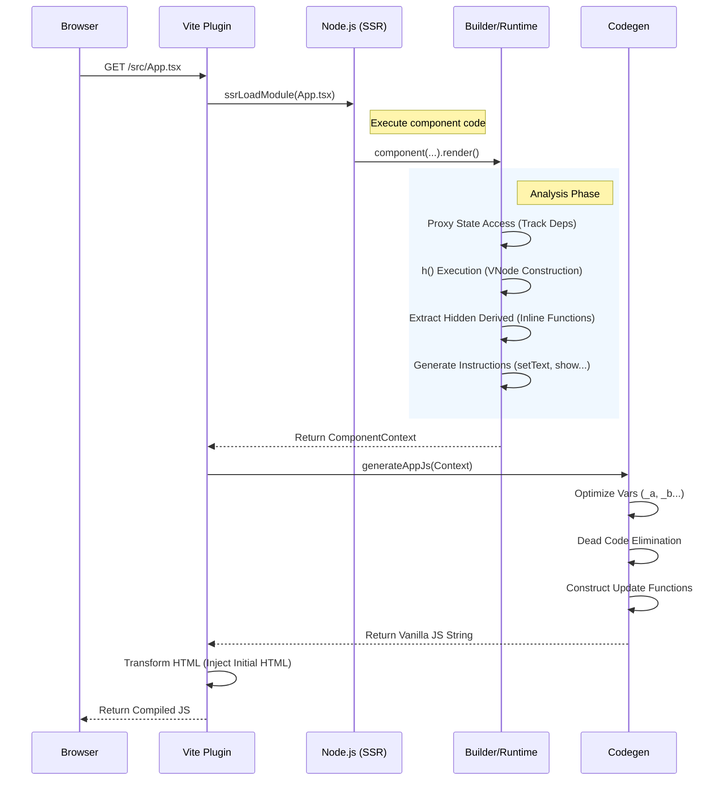
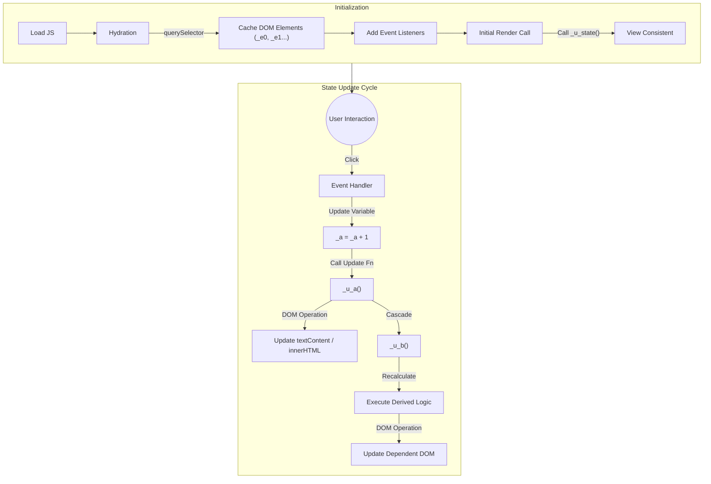

# Internal Processing Flow

Quix がソースコード (`.tsx`) をブラウザで動作する JavaScript/HTML に変換し、画面更新を行うまでの詳細なフローです。

## Phase 1: 解析とコンパイル (Build Time)

Vite サーバー上でリクエストが発生した際に行われる処理です。

1.  **Intercept (Vite Plugin)**
    *   `.tsx` へのリクエストを検知。
    *   `ssrLoadModule` を使用して、ユーザーのコンポーネントコードを Node.js 環境で実行します。

2.  **Builder Execution (`builder.ts`)**
    *   `component(...)` 関数が実行され、`ComponentContext` が生成されます。
    *   `state()`, `derived()` などの定義が Context 内の `nodes` マップに登録されます（ID は `s-App-0` のように決定論的に生成）。

3.  **Render & Tracking (`tracker.ts`, `h.ts`)**
    *   `render()` メソッド内の関数が実行されます。
    *   この際、`state` オブジェクトは **Proxy** になっています。getter が走ると、現在解析中のノード ID が `tracker` に報告されます。
    *   `h()` 関数 (JSX) が実行され、仮想 DOM (`VNode`) を構築します。
        *   **インライン関数:** `{() => state.count()}` は自動的に抽出され、`Hidden Derived` ノードとして登録されます。
        *   **制御構文:** `<Show>` などは専用の命令 (`show`) に変換され、プレースホルダー（アンカー）の HTML を生成します。

4.  **Code Generation (`codegen.ts`)**
    *   完成した `ComponentContext` (HTML 文字列 + 依存グラフ + 命令リスト) を元に、JS 文字列を生成します。
    *   **Dead Code Elimination:** DOM 更新に関与しない不要な計算ロジックは削除されます。
    *   **Variable Renaming:** ID (`s-App-0`) は短い変数名 (`_a`, `_b`) に置換されます。
    *   **Instruction Compile:** `setText` や `show` などの抽象命令が、具体的な `textContent = ...` や `innerHTML = ...` に変換されます。

5.  **Output**
    *   **HTML:** `transformIndexHtml` フックにより、静的解析された HTML が `index.html` に注入されます（初期表示の高速化・FOUC防止）。
    *   **JS:** 生成された Vanilla JS コードがブラウザへ送信されます。

---

## Phase 2: ブラウザでの実行 (Runtime)

ブラウザに配信されたファイル (`App.tsx` という名の生成済み JS) の動作です。

1.  **Hydration (Initialization)**
    *   `document.getElementById` や `querySelector` を使い、HTML として既に存在する DOM 要素への参照を取得し、変数（`_e0` 等）にキャッシュします。
    *   `addEventListener` でイベントハンドラを設定します。
    *   初期状態 (`state`) の変数を宣言します。

2.  **Initial Render**
    *   生成されたコードの末尾で、各ステートの更新関数 (`_u_a()`) が一度だけ呼び出され、初期値の整合性が確保されます（ただし、HTML は既にサーバーから注入されているため、見た目は変わりません）。

3.  **State Update**
    *   ユーザーアクション（クリック等）によりイベントハンドラが発火します。
    *   ハンドラ内のロジック（例: `_a = _a + 1`）が実行され、変数が更新されます。
    *   続いて、そのステートに対応する更新関数（例: `_u_a()`）が呼び出されます。

4.  **Cascade Update**
    *   更新関数 (`_u_a`) は以下の順序で実行されます：
        1.  **DOM Update:** 自身に紐付いた DOM 操作（`textContent` 更新など）を実行。
        2.  **Dependency Propagation:** 自身に依存している `Derived` ノードの更新関数 (`_u_b()`) を呼び出す。
    *   この連鎖により、必要な箇所だけが最小限のコストで書き換わります。